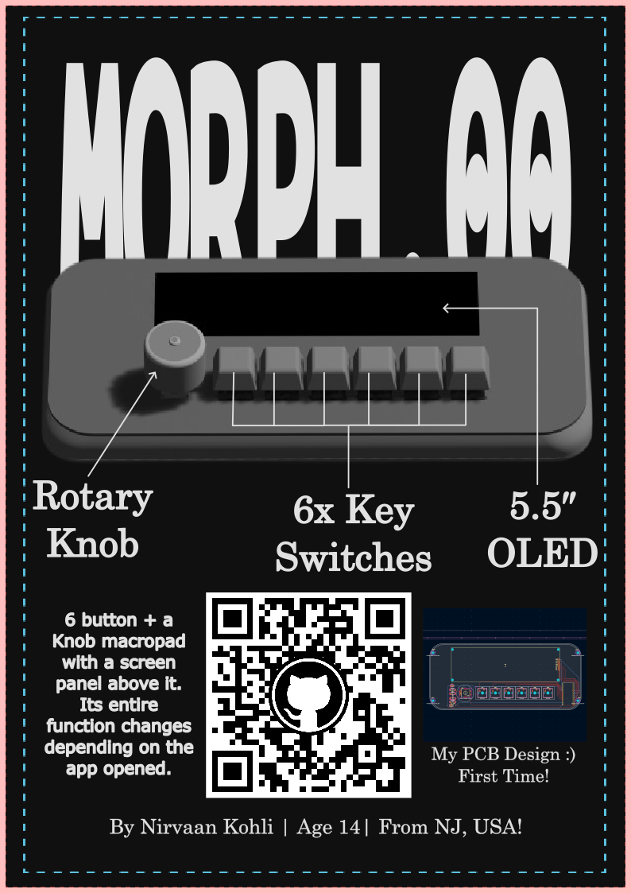
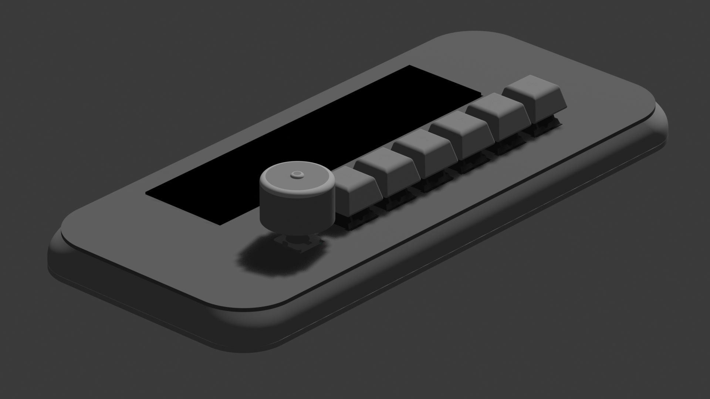
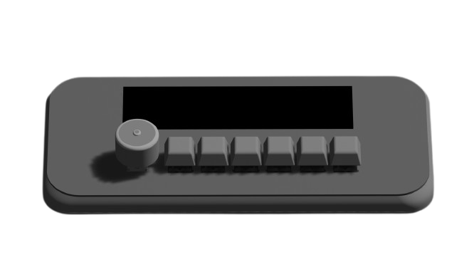
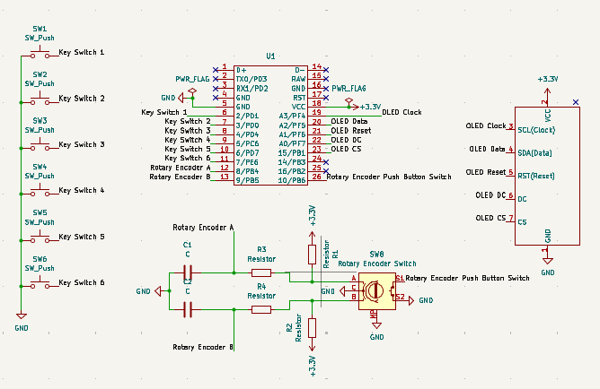
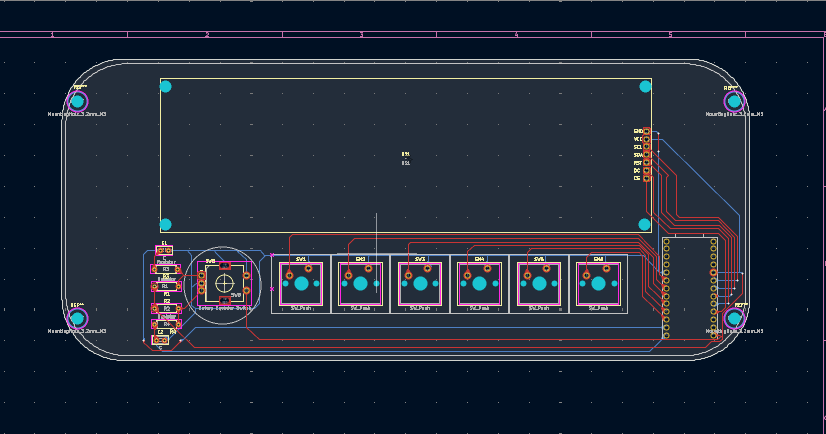
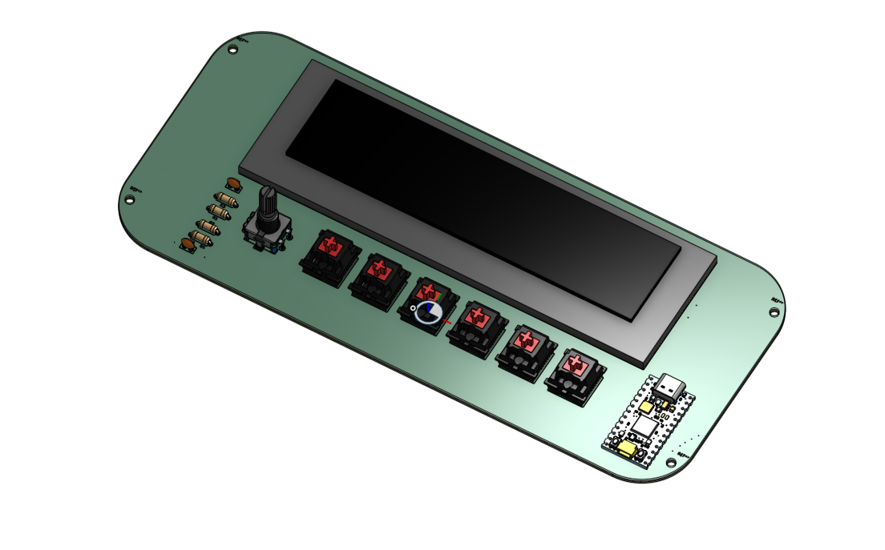

# MORPH.00

---

MORPH.00 is a keyboard with 6 key switches and a rotary encoder that can change(morph their function). It also has an OLED to display each key or encoder's function at any given time. It is powered by the RP2040!

---

## Initial Thoughts & Reflection

When I initially found about fallout, I knew it was an one in a lifetime opportunity. I also knew that I did not know anything about hardware. So I looked online and on youtube and decided that a macropad was perfect for me. After a few days of brainstorming, I decided to settle for the best balance between challenging and easy(this project). Also it was pretty cool, cus like who would not want a keyboard that can change functions based on the app you are on to make work less repetitive. 

---

Looking back, this project was filled with a lot of firsts. I also had so much fun. Like who knew how relaxing some parts could be and how enraging others could be. Anyways, I learned my first real CAD software, onshape. I will definitely be using it in VEX Robotics as most of our team's CAD team seniored out. It took me some time to get comfortable but it is pretty cool. It was also my first time with KiCad. Making the schematic was interesting, pcb routing was so relaxing, but the errors sadly was not.

---

## A Little Summary

The keyboard is powered by a RP2040 on a [KB2040 Microcontroller](https://www.adafruit.com/product/5302?srsltid=AfmBOoqLa_n90N7_AYh5a78pJlOBana2qBx5fNuULukl6r5Ai2WtEuWO) running CircuitPython with many adafruit libraries. This is stuffed on the bottom-right side of the pcb board/keyboard and is the reason for it's goofy shape and proportions.

The six switches are Cherry MXs, the rotary encoder an EC11 Rotary Encoder, and the OLED a 5.5 Inch 256x64 display. There is also a part of this project on the host computer that sends info like key, encoder, or OLED changes to the keyboard.

--- 

# CAD Renderings

CAD was a very infuriating experience if I may add.

---

## PCB + Schematic

This is my final schematic

This schematic went through multiple, multiple changes. Like when I had to add power symbols, make a denouncer circuit, custom design the OLED symbol like 2 times, and change the GPIO pins for my OLED. I liked this portion a lot actually.

### Final PCB

I added a lot of stuff bc the Internet said so :). So hopefully that was not a mistake. I was also just informed no 90 or acute angles so maybe not so final pcb :(.

----

### How to Use?

This is relatively easy to use assuming it is all put together and well. All you need to do is drag firmware/software files into the KB2040 and let the host computer code run as a background process.

The computer process will be listening on a port. From there you can read the documentation available in code/keyboard/ on how to automate the OLED, switches, and encoder functions. 

From there, it is just using the macropad as a macropad.

---

# How to construct it?

Since I have not had the pleasure of constructing this, I can't tell you for sure but below is how to build it if everything goes as planned.

1. Soldering Components
   1. This step assumes you have bought everything in the BOM.
   2. The first step is to solder all the components on to the PCB.
      1. Use the various KiCad files as reference to know where to put components if you are confused.
2. 3D Printing Case
   1. This again assumes you have a 3D printer or some way to get your hands on a physical version of the case(files in /cad).
   2. This is pretty self-explanatory as you need to obtain all 3D printed objects in cad/print.
3. Assembling the Body of the Macropad
   1. Use M3 screws and nylocks to fasten the OLED on to the PCB plate.
   2. Put the top plate on the board.
   3. It should click into place thanks to the Cherry MX switches.
   4. Slide your usb c cable through the hole on the side of the case. For future use plug that cable into your host computer.
   5. Then take your 3mm Spacer and insert it between the bottom of the PCB and plate(use washers for any weird space)
   6. Insert the screw on the bottom of the bottom plate 
   7. On the top of the pcb plate place a M3 nylock and fasten.
   8. Repeat for all other 3 corners.
   9. For extra precaution optionally add some type of adhesive between the top plate's side and the bottom plate's edges.
4. Add Keycaps and Cover for Encoder
   1. Start by putting a keycap on one of the switches. The keycap should slide in and click.
   2. Repeat for the remaining 5 keycaps.
   3. For the Rotary Encoder, simply press down the rotary encoder cover on the Rotary Encoder, and with some force it should slide in.

---

Congrats! You have know constructed MORPH.00. Hopefully it should work.

---

# BOM

Check `bom.csv`!

---
